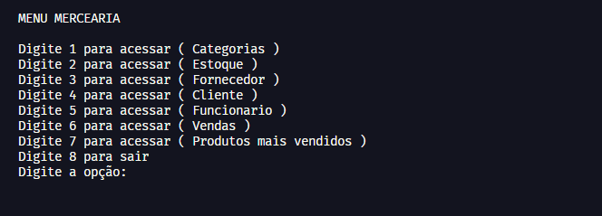

# <strong>Gerenciamento de mercearia em python</strong>



> Nesse projeto foi feito na finalidade de testar meus conhecimentos sobre python e padrão MVC. Feito no curso PythonFull.

## 🛠️ Funcionalidades 

* Cadastrar
* Remover
* Alterar
* Vizualizar

## 💻 Pré-requisitos

Antes de começar, verifique se você atendeu aos seguintes requisitos:
<!---Estes são apenas requisitos de exemplo. Adicionar, duplicar ou remover conforme necessário--->
* Você instalou a versão mais recente de `Python 3.10.2`
* Você tem uma máquina `Windows / Linux / Mac`.

## ☕ Usando gerenciamento_de_mercearia

Para usar `gerenciamento_de_mercearia`, siga estas etapas:

```bash
$ git clone https://github.com/isaquedesousa2/gerenciamento-de-mercearia-python.git

Execute o arquivo `view.py` no terminal
```


